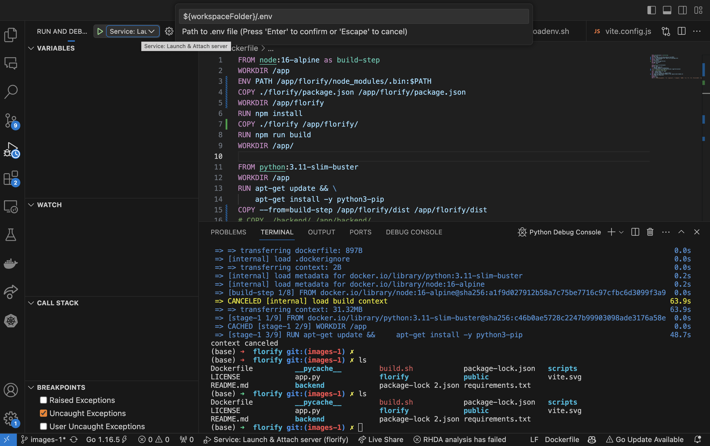
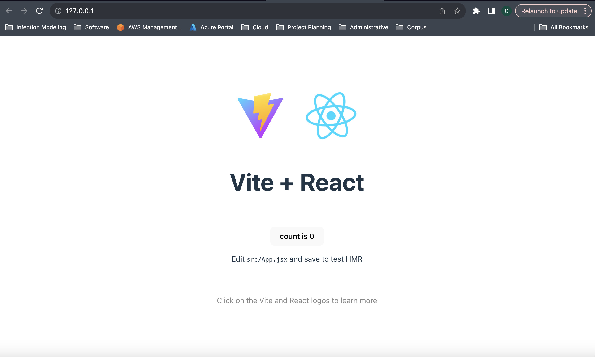

# Florify
A generalizable floor-event mapping application.

# Local Setup  

The `.vscode/` launch and task configuration is setup to run debugging sessions. The setup runs `./build.sh`, which builds the node and python environments, and then serves the app on port 80.

